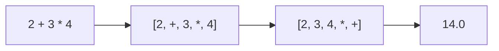
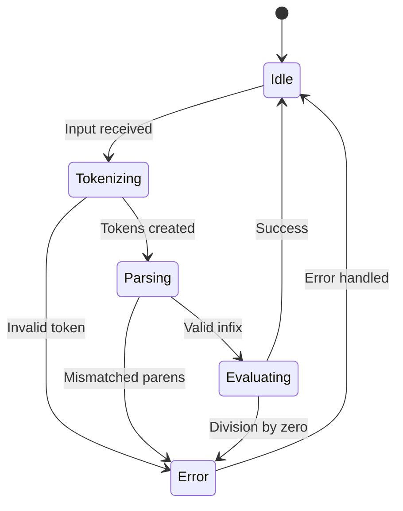
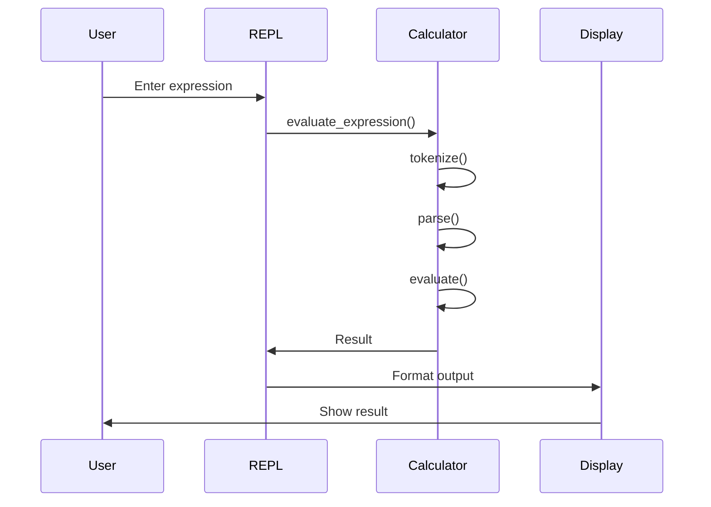
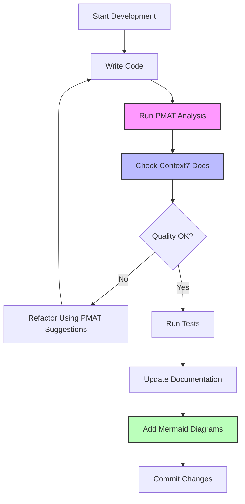

# MCP Integration Guide for pmatinit

This guide covers all Model Context Protocol (MCP) servers integrated with the pmatinit calculator project.

## What are MCPs?

Model Context Protocol (MCP) is an open standard that enables AI assistants to securely connect to external tools, data sources, and services. MCPs extend Claude Code's capabilities beyond the built-in tools.

## Configured MCPs for This Project

### 1. PMAT MCP (Code Quality Analysis)

**Purpose**: Static code analysis, technical debt grading, complexity metrics, and defect prediction for Rust projects.

**Capabilities**:
- Static code analysis (cyclomatic complexity, cognitive complexity, maintainability index)
- Technical Debt Grading (TDG) with A+ to F scores
- Defect prediction analysis
- Provability analysis
- Mutation testing
- SATD (Self-Admitted Technical Debt) detection
- Code hotspot identification

**Installation**:
```bash
# PMAT is already installed as a project dependency
cargo install pmat

# Verify installation
pmat --version
```

**Usage with Subagents**:
- Use `pmat-static-analyzer` subagent for comprehensive analysis
- Use `pmat-analysis` skill for quick quality checks
- Use `pmat-mcp-expert` subagent for advanced MCP features

**Example Commands**:
```bash
# Full project analysis
pmat analyze src/

# Technical Debt Grading
pmat analyze_tdg src/

# Find code hotspots
pmat lint-hotspots src/ --top 10

# Complexity analysis
pmat complexity src/ --threshold 10
```

**MCP Tools Available** (18 tools):
1. `analyze` - Comprehensive code analysis
2. `analyze_tdg` - Technical Debt Grading
3. `complexity` - Complexity metrics
4. `defect-prediction` - Predict defect-prone areas
5. `provability` - Formal provability analysis
6. `mutation-test` - Mutation testing
7. `generate-context` - Context generation for AI
8. `lint-hotspots` - Find problem areas
9. `dead-code` - Detect unused code
10. `duplicate-code` - Find code duplication
11. `security-audit` - Security analysis
12. `dependency-analysis` - Check dependencies
13. `generate-report` - Create HTML/JSON reports
14. `compare-versions` - Compare code versions
15. `trend-analysis` - Track metrics over time
16. `refactor-suggestions` - Get refactoring advice
17. `code-smells` - Detect code smells
18. `test-coverage-analysis` - Coverage metrics

### 2. Context7 MCP (Real-Time Documentation)

**Purpose**: Provides real-time access to the latest Rust documentation, crate docs, and ecosystem information.

**Capabilities**:
- Access to docs.rs for all crates
- Latest Rust Book and Reference
- Crate version information
- API documentation lookup
- Search across Rust ecosystem

**Installation**:
```bash
# Context7 is typically configured through MCP settings
# Check Claude Code documentation for specific setup
```

**Usage**:
- Automatically provides up-to-date documentation during development
- Especially useful for checking:
  - Latest API changes in dependencies (clap, rustyline, anyhow, thiserror)
  - Rust standard library updates
  - Best practices and patterns

**Benefits for pmatinit**:
- Keep up with clap 4.5 API changes
- Access rustyline 14.0 documentation
- Check thiserror 2.0 macro usage
- Verify anyhow error handling patterns

### 3. Playwright MCP (Browser Testing)

**Purpose**: Browser automation and testing for web interfaces.

**Current Status**: Not immediately applicable to CLI calculator, but valuable for future phases.

**Future Use Cases**:
- **Phase 4**: Web interface testing
  - Automated browser testing of calculator UI
  - Cross-browser compatibility checks
  - Screenshot testing
  - Performance testing

- **Phase 5**: Documentation site testing
  - Test Docusaurus documentation site
  - Verify interactive examples work
  - Check responsive design
  - Validate navigation

**Installation** (when needed):
```bash
# Playwright will be configured when Phase 4 begins
npm install -D @playwright/test
npx playwright install
```

**Potential Test Scenarios**:
```javascript
// Example for future web calculator
test('calculator performs addition', async ({ page }) => {
  await page.goto('http://localhost:3000');
  await page.fill('#input', '2 + 2');
  await page.click('#calculate');
  await expect(page.locator('#result')).toHaveText('4.00');
});
```

### 4. Figma MCP (Design Integration)

**Purpose**: Access Figma designs and convert to code.

**Current Status**: Not immediately applicable, but valuable for Phase 4 (web interface).

**Future Use Cases**:
- **Phase 4**: Web UI implementation
  - Import calculator UI designs from Figma
  - Generate component code from designs
  - Extract colors, spacing, typography
  - Ensure design-code consistency

- **Documentation**: Visual assets
  - Export architecture diagrams from Figma
  - Create UI mockups for documentation
  - Design icons and branding

**Installation** (when needed):
```bash
# Figma MCP configuration through Claude Code settings
# Requires Figma API token
```

**Workflow Example**:
1. Designer creates calculator UI in Figma
2. Developer uses Figma MCP to inspect design
3. Extract design tokens (colors, fonts, spacing)
4. Generate component boilerplate
5. Implement logic while maintaining design fidelity

### 5. Mermaid Diagrams (Built-in Support)

**Purpose**: Create visual documentation directly in Markdown and Rustdoc.

**Capabilities**:
- Flowcharts for algorithm visualization
- Sequence diagrams for interaction flows
- State diagrams for state machines
- Class diagrams for structure
- Architecture diagrams

**Already Integrated**: The `rust-doc-quality-expert` subagent has comprehensive Mermaid support.

**Usage in pmatinit**:

**Architecture Diagram**:
```rust
/// # Calculator Architecture
///
/// ```mermaid
/// graph TB
///     A[User Input] --> B[Tokenizer]
///     B --> C[Parser: Shunting Yard]
///     C --> D[Evaluator: Postfix]
///     D --> E[Result]
///
///     B -->|Error| F[Error Handler]
///     C -->|Error| F
///     D -->|Error| F
/// ```
pub mod calculator {
    // Implementation
}
```

**Expression Flow**:


**State Machine**:


**REPL Interaction**:


**Add to Documentation**:
```bash
# View with Mermaid support
cargo doc --open

# Or integrate with Docusaurus (Phase 5)
```

### 6. Docusaurus 2 (Documentation Site)

**Purpose**: Build comprehensive, searchable documentation site.

**Current Status**: Planned for Phase 5.

**Setup** (for Phase 5):
```bash
# Create Docusaurus site
npx create-docusaurus@latest docs classic

cd docs

# Install Rust code highlighting
npm install --save prism-react-renderer

# Add Mermaid support
npm install --save @docusaurus/theme-mermaid

# Serve locally
npm start

# Build for production
npm run build
```

**Project Structure** (when implemented):
```
docs/
├── docs/
│   ├── intro.md                    # Getting started
│   ├── installation.md             # Installation guide
│   ├── usage/
│   │   ├── cli.md                  # CLI usage
│   │   ├── repl.md                 # REPL mode
│   │   └── expressions.md          # Supported expressions
│   ├── api/
│   │   ├── calculator.md           # Calculator API
│   │   ├── parser.md               # Parser API
│   │   └── evaluator.md            # Evaluator API
│   ├── architecture/
│   │   ├── overview.md             # System overview
│   │   ├── algorithms.md           # Shunting Yard, etc.
│   │   └── error-handling.md       # Error handling
│   ├── development/
│   │   ├── contributing.md         # Contribution guide
│   │   ├── testing.md              # Testing guide
│   │   └── subagents.md            # Using Claude Code subagents
│   └── deployment/
│       ├── aws.md                  # AWS deployment
│       └── docker.md               # Docker deployment
├── docusaurus.config.js
├── sidebars.js
└── static/
    └── rustdoc/                    # Generated rustdoc
```

**Integration with Rustdoc**:
```bash
# Generate rustdoc
cargo doc --no-deps

# Copy to Docusaurus
cp -r target/doc docs/static/rustdoc

# Link from Docusaurus
echo "[API Documentation](pathname:///rustdoc/pmatinit/index.html)" >> docs/docs/api.md
```

**Docusaurus Configuration**:
```javascript
// docusaurus.config.js
module.exports = {
  title: 'pmatinit Calculator',
  tagline: 'A powerful command-line calculator in Rust',
  url: 'https://your-domain.com',
  baseUrl: '/',

  themeConfig: {
    navbar: {
      title: 'pmatinit',
      items: [
        {
          type: 'doc',
          docId: 'intro',
          label: 'Docs',
        },
        {
          href: 'pathname:///rustdoc/pmatinit/index.html',
          label: 'API',
        },
        {
          href: 'https://github.com/user/pmatinit',
          label: 'GitHub',
        },
      ],
    },
    prism: {
      theme: lightCodeTheme,
      additionalLanguages: ['rust', 'toml', 'bash'],
    },
  },

  markdown: {
    mermaid: true,
  },

  themes: ['@docusaurus/theme-mermaid'],
};
```

## MCP Integration Workflow

### Development Workflow with MCPs



### Using MCPs with Subagents

**Quality Assurance Flow**:
1. `rust-feature-builder` implements feature
2. `pmat-static-analyzer` runs PMAT analysis
3. `rust-code-reviewer` reviews code quality
4. `rust-tester` writes comprehensive tests
5. `rust-doc-quality-expert` adds Mermaid diagrams and docs
6. `rust-orchestrator` coordinates the flow

**Documentation Flow**:
1. Write code with doc comments
2. Add Mermaid diagrams for complex logic
3. Run doc tests: `cargo test --doc`
4. Generate docs: `cargo doc --open`
5. (Phase 5) Integrate with Docusaurus site

### Current Project MCP Usage

**Active MCPs**:
- ✅ **PMAT MCP**: Fully integrated with subagents and skills
- ✅ **Mermaid**: Available for documentation
- ⏳ **Context7**: Available through Claude Code (automatic)

**Future MCPs** (Phase 4+):
- ⏳ **Playwright**: For web interface testing
- ⏳ **Figma**: For design-to-code workflow
- ⏳ **Docusaurus**: For documentation site

## Quick Reference

### PMAT Commands
```bash
# Comprehensive analysis
pmat analyze src/

# Quick quality check
pmat analyze_tdg src/ --format json

# Find issues
pmat lint-hotspots src/ --top 5
```

### Documentation Commands
```bash
# Doc tests
cargo test --doc

# Generate docs with Mermaid
cargo doc --open

# Check doc coverage
RUSTDOCFLAGS="-D missing_docs" cargo doc --no-deps

# Check links
cargo install cargo-deadlinks
cargo deadlinks --check-http
```

### Subagent Invocations
```bash
# Use PMAT analysis
# Invoke: pmat-static-analyzer subagent

# Quality check with docs
# Invoke: rust-doc-quality-expert subagent

# Full code review
# Invoke: rust-code-reviewer subagent

# Orchestrate multiple tasks
# Invoke: rust-orchestrator subagent
```

## Best Practices

### 1. Regular PMAT Analysis
- Run before each commit
- Track technical debt over time
- Address high-complexity functions
- Monitor maintainability index

### 2. Documentation Testing
- Test all code examples
- Keep Mermaid diagrams updated
- Check links regularly
- Maintain API documentation

### 3. Visual Documentation
- Use Mermaid for complex algorithms
- Add sequence diagrams for interactions
- Create state diagrams for state machines
- Include architecture diagrams

### 4. Continuous Integration
```yaml
# .github/workflows/quality.yml
name: Quality Checks

on: [push, pull_request]

jobs:
  pmat-analysis:
    runs-on: ubuntu-latest
    steps:
      - uses: actions/checkout@v3

      - name: Install PMAT
        run: cargo install pmat

      - name: Run PMAT Analysis
        run: pmat analyze src/ --format json > pmat-report.json

      - name: Check Technical Debt
        run: |
          GRADE=$(pmat analyze_tdg src/ | grep -oP 'Grade: \K[A-F][+-]?')
          echo "Technical Debt Grade: $GRADE"
          # Fail if grade is below C
          [[ "$GRADE" =~ ^[ABC] ]] || exit 1

  doc-tests:
    runs-on: ubuntu-latest
    steps:
      - uses: actions/checkout@v3

      - name: Test documentation
        run: cargo test --doc

      - name: Check doc coverage
        run: RUSTDOCFLAGS="-D missing_docs" cargo doc --no-deps
```

## Troubleshooting

### PMAT Issues
```bash
# If PMAT not found
cargo install pmat

# If version mismatch
cargo update pmat

# Check PMAT version
pmat --version
```

### Documentation Issues
```bash
# If Mermaid not rendering
# Ensure using compatible rustdoc version
rustc --version

# If doc tests fail
cargo test --doc --verbose

# Clear doc cache
cargo clean --doc
```

### MCP Connection Issues
```bash
# Check Claude Code MCP settings
# Verify MCP servers are configured correctly
# Check logs for connection errors
```

## Next Steps

1. **Immediate** (Phase 0-1):
   - Use PMAT MCP for code quality
   - Add Mermaid diagrams to documentation
   - Set up doc testing in CI/CD

2. **Phase 4** (Web Interface):
   - Configure Playwright MCP
   - Set up Figma MCP
   - Integrate browser testing

3. **Phase 5** (Documentation Site):
   - Set up Docusaurus 2
   - Integrate rustdoc
   - Deploy documentation site

## Resources

- **PMAT**: https://github.com/paiml/pmat
- **Mermaid**: https://mermaid.js.org/
- **Docusaurus**: https://docusaurus.io/
- **Context7**: Claude Code MCP documentation
- **Playwright**: https://playwright.dev/
- **Figma API**: https://www.figma.com/developers/api

---

**Document Version**: 1.0
**Last Updated**: 2025-10-25
**Project Phase**: Phase 0 ✅ Complete
